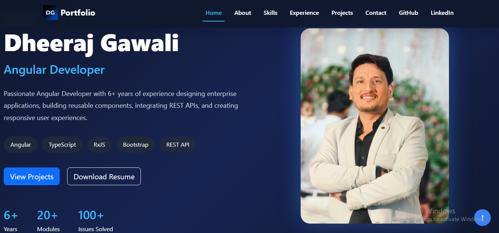
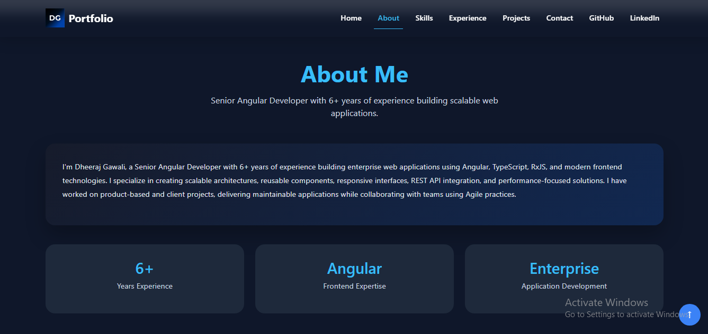
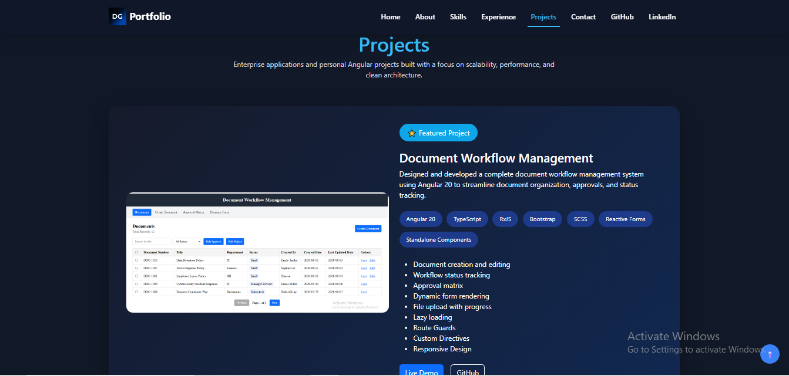
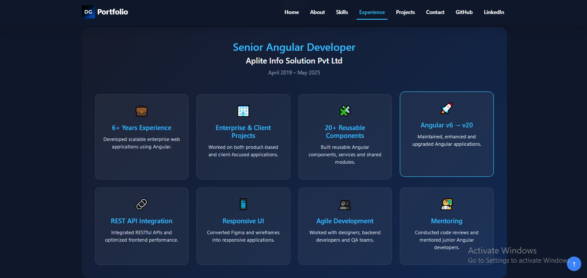
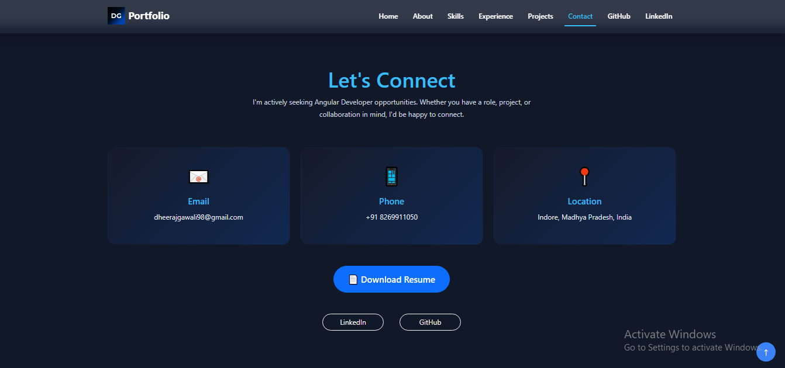

# 🌐 Dheeraj Gawali - Portfolio

A modern, responsive portfolio built with **Angular 20** showcasing my experience, technical skills, and Angular projects.

## 🚀 Live Demo

👉 https://dheeraj-gawali.github.io/portfolio/

## 📌 About

I'm **Dheeraj Gawali**, a Senior Angular Developer with **6+ years of experience** building scalable, responsive, and enterprise web applications.

This portfolio highlights my professional experience, featured projects, technical skills, and contact information.

## ✨ Features

- 🎨 Modern and responsive UI
- ⚡ Built with Angular 20 Standalone Components
- 📱 Fully responsive for desktop, tablet, and mobile
- 🌙 Clean dark theme
- 🚀 Smooth scrolling navigation
- 📂 Featured Angular projects
- 💼 Professional experience timeline
- 🛠 Technical skills section
- 📄 Resume download
- 📬 Contact section

## 🛠 Tech Stack

| Technology | Purpose |
|------------|---------|
| Angular 20 | Frontend Framework |
| TypeScript | Programming Language |
| HTML5 | Markup |
| SCSS | Styling |
| Bootstrap 5 | Responsive Design |
| RxJS | Reactive Programming |
| Git & GitHub | Version Control |

## 📂 Project Structure

```text
src
│
├── app
│   ├── features
│   │   ├── home
│   │   ├── about
│   │   ├── skills
│   │   ├── experience
│   │   ├── projects
│   │   └── contact
│   │
│   └── layout
│       ├── header
│       └── footer
│
├── assets
└── styles.scss
```

## ⚙ Installation

Clone the repository

```bash
git clone https://github.com/Dheeraj-Gawali/portfolio.git
```

Navigate to the project

```bash
cd portfolio
```

Install dependencies

```bash
npm install
```

Run locally

```bash
ng serve
```

Open

```text
http://localhost:4200
```

## 🚀 Deployment

Build for GitHub Pages

```bash
npm run build:gh
```

Deploy

```bash
npm run deploy
```
## 📸 Screenshots

### Home



---

### About



---

### Projects



---

### Experience



---

### Contact



## 📬 Contact

**Dheeraj Gawali**

📧 Email: your-email@gmail.com

💼 LinkedIn:
https://linkedin.com/in/dheeraj-gawali-46272017a

💻 GitHub:
https://github.com/Dheeraj-Gawali

## 📄 License

This project is open source and available under the MIT License.